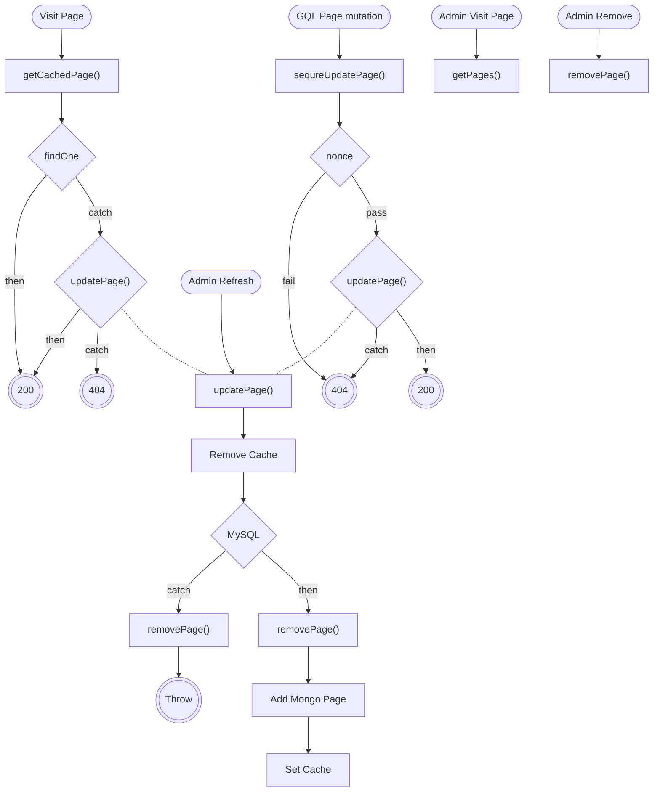
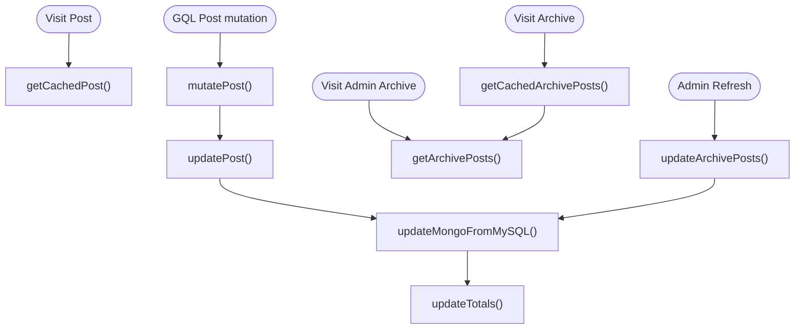
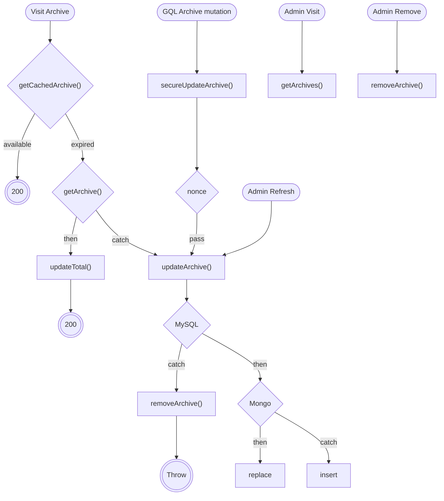
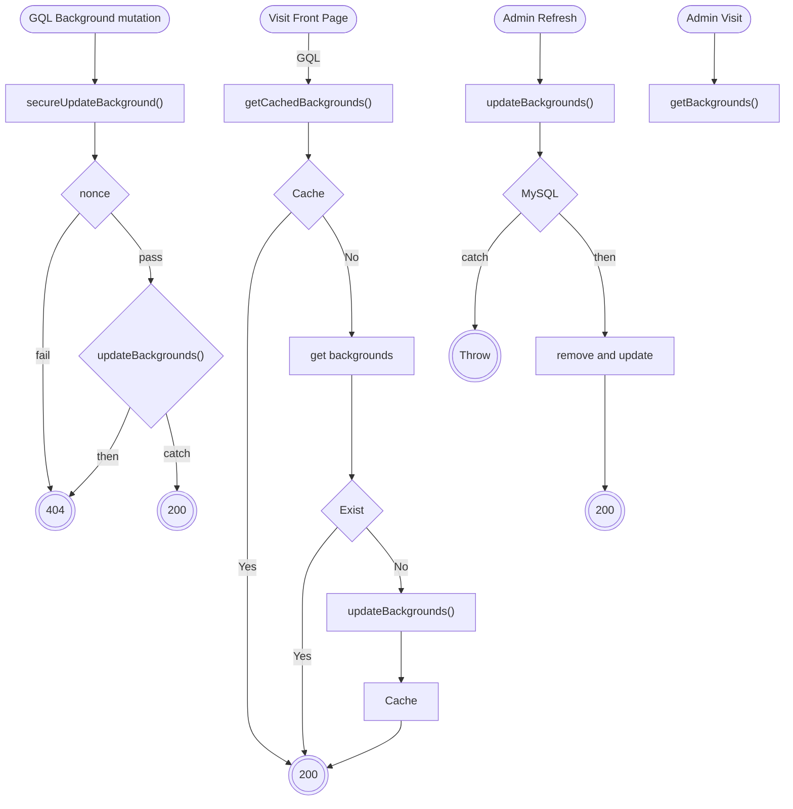

# Page

```mermaid
flowchart
    A@{ shape: stadium, label: "Visit Page" } --> A1["getCachedPage()"]
    A1 --> A3@{ shape: diamond, label: "findOne" }
    A3 -->|then| A4@{ shape: dbl-circ, label: "200" }
    A3 -->|catch| A5@{ shape: diamond, label: "updatePage()" }
    A5 -->|then| A4
    A5 -->|catch| A6@{ shape: dbl-circ, label: "404" }

    B@{ shape: stadium, label: "GQL Page mutation" } --> B1["sequreUpdatePage()"]
    B1 --> B2@{ shape: diamond, label: "nonce" }
    B2 -->|fail| B3@{ shape: dbl-circ, label: "404" }
    B2 -->|pass| B4@{ shape: diamond, label: "updatePage()" }
    B4 -.- C0
    B4 -->|catch| B3
    B4 -->|then| B5@{ shape: dbl-circ, label: "200" }

    C@{ shape: stadium, label: "Admin Refresh" } --> C0["updatePage()"]
    C0 --> C1[Remove Cache]
    C1 --> C3@{ shape: diamond, label: "MySQL" }
    C3 -->|catch| C4["removePage()"]
    C3 -->|then| C5["removePage()"]
    C5 --> C6[Add Mongo Page]
    C6 --> C7[Set Cache]
    C4 --> C8@{ shape: dbl-circ, label: "Throw" }

    D@{ shape: stadium, label: "Admin Visit Page" } --> D1["getPages()"]
    E@{ shape: stadium, label: "Admin Remove" } --> E1["removePage()"]

    A5 -.- C0
```

# Post

```mermaid
flowchart
    A@{ shape: stadium, label: "Visit Post" } --> A1["getCachedPost()"]

    B@{ shape: stadium, label: "GQL Post mutation" } --> B1["mutatePost()"]
    B1 --> B2["updatePost()"]

    C@{ shape: stadium, label: "Visit Archive" } --> C1["getCachedArchivePosts()"]

    D@{ shape: stadium, label: "Visit Admin Archive" } --> D1["getArchivePosts()"]

    E@{ shape: stadium, label: "Admin Refresh" } --> E1["updateArchivePosts()"]

    Z["updateMongoFromMySQL()"] --> Z1["updateTotals()"]

    B2 --> Z
    E1 --> Z
    C1 --> D1
```

# Archive

```mermaid
flowchart
    A@{ shape: stadium, label: "Visit Archive" } --> G1@{ shape: diamond, label: "getCachedArchive()" }
    G1 -->|available| G10@{ shape: dbl-circ, label: "200" }
    G1 -->|expired| G3@{ shape: diamond, label: "getArchive()" }
    G3 -->|then| G9["updateTotal()"]
    G3 -->|catch| J6
    G9 --> G11@{ shape: dbl-circ, label: "200" }

    B@{ shape: stadium, label: "GQL Archive mutation" } --> I1
    I1["secureUpdateArchive()"] --> I2@{ shape: diamond, label: "nonce" }
    I2 -->|pass| J6

    J1@{ shape: stadium, label: "Admin Visit" } --> J2["getArchives()"]

    J3@{ shape: stadium, label: "Admin Remove" } --> J4["removeArchive()"]

    J5@{ shape: stadium, label: "Admin Refresh" } --> J6["updateArchive()" ]
    J6 --> K3@{ shape: diamond, label: "MySQL" }
    K3 -->|catch| K4["removeArchive()"]
    K3 -->|then| K5@{ shape: diamond, label: "Mongo" }
    K5 -->|then| K6["replace"]
    K5 -->|catch| K7["insert"]
    K4 --> K9@{ shape: dbl-circ, label: "Throw" }
```

# Background

```mermaid
flowchart
    A@{ shape: stadium, label: "Visit Front Page" } -->|GQL| A1["getCachedBackgrounds()"]
    A1 --> A2@{ shape: diamond, label: "Cache" }
    A2 -->|Yes| A3@{ shape: dbl-circ, label: "200" }
    A2 -->|No| A4["get backgrounds"]
    A4 --> A5@{ shape: diamond, label: "Exist" }
    A5 -->|Yes| A3
    A5 -->|No| A6["updateBackgrounds()"]
    A6 --> A7["Cache"]
    A7 --> A3

    B@{ shape: stadium, label: "GQL Background mutation" } --> B1["secureUpdateBackground()"]
    B1 --> B2@{ shape: diamond, label: "nonce" }
    B2 -->|fail| B3@{ shape: dbl-circ, label: "404" }
    B2 -->|pass| B4@{ shape: diamond, label: "updateBackgrounds()" }
    B4 -->|then| B3
    B4 -->|catch| B5@{ shape: dbl-circ, label: "200" }

    C@{ shape: stadium, label: "Admin Refresh" } --> C1["updateBackgrounds()" ]
    C1 --> C2@{ shape: diamond, label: "MySQL" }
    C2 -->|catch| C3@{ shape: dbl-circ, label: "Throw" }
    C2 -->|then| C4["remove and update"]
    C4 --> C5@{ shape: dbl-circ, label: "200" }

    D@{ shape: stadium, label: "Admin Visit" } --> D1["getBackgrounds()" ]
```
