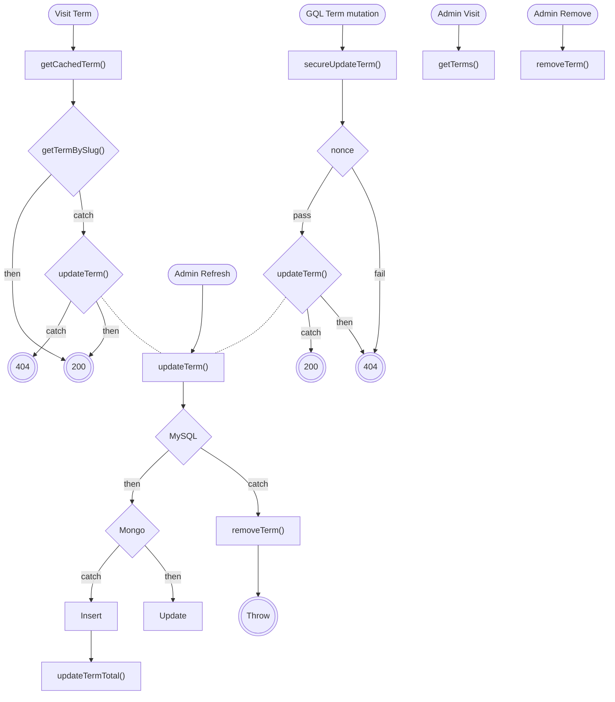

# mermaid diagram

```mermaid
flowchart
    A@{ shape: stadium, label: "Visit Term" } --> G1["getCachedTerm()"]
    G1 --> G3@{ shape: diamond, label: "getTermBySlug()" }
    G3 -->|catch| G4@{ shape: diamond, label: "updateTerm()" }
    G3 -->|then| G5@{ shape: dbl-circ, label: "200" }
    G4 -.- J6
    G4 -->|then| G5
    G4 -->|catch| G8@{ shape: dbl-circ, label: "404" }

    B@{ shape: stadium, label: "GQL Term mutation" } --> I1
    I1["secureUpdateTerm()"] --> I2@{ shape: diamond, label: "nonce" }
    I2 -->|fail| I3@{ shape: dbl-circ, label: "404" }
    I2 -->|pass| I4@{ shape: diamond, label: "updateTerm()" }
    I4 -->|then| I3
    I4 -->|catch| I5@{ shape: dbl-circ, label: "200" }

    J1@{ shape: stadium, label: "Admin Visit" } --> J2["getTerms()"]

    J3@{ shape: stadium, label: "Admin Remove" } --> J4["removeTerm()"]

    J5@{ shape: stadium, label: "Admin Refresh" } --> J6["updateTerm()" ]

    J6 --> K3@{ shape: diamond, label: "MySQL" }
    K3 -->|catch| K4["removeTerm()"]
    K3 -->|then| K5@{ shape: diamond, label: "Mongo" }
    K5 -->|then| K6["Update"]
    K5 -->|catch| K7["Insert"]
    K4 --> K9@{ shape: dbl-circ, label: "Throw" }

    I4 -.- J6

    K7 --> TERM1["updateTermTotal()"]
```
